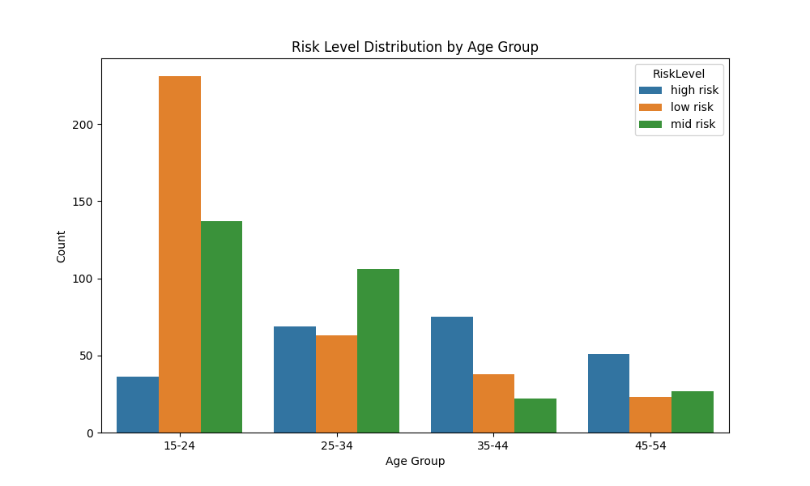
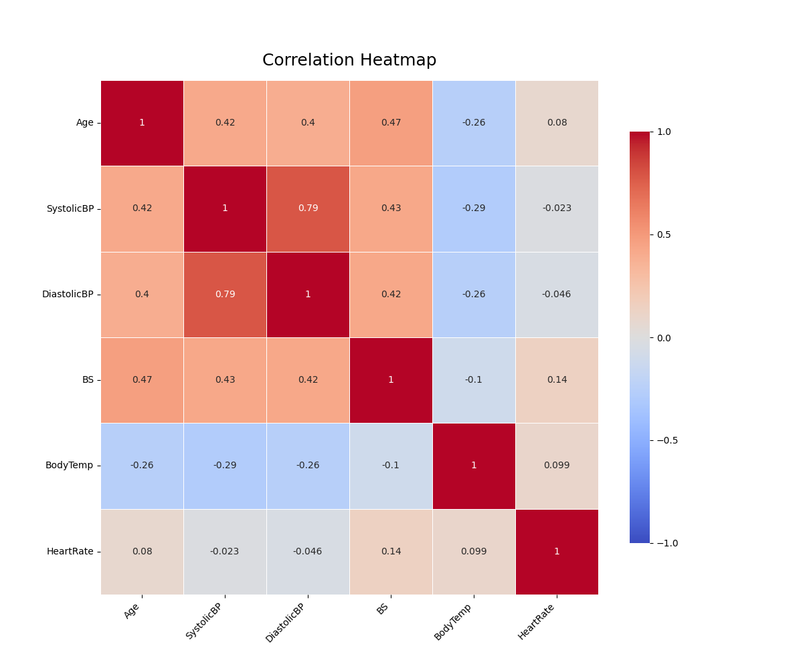

# Maternal Health Risk

## Description

This project analyzes maternal health risk data to explore relationships between various health metrics and risk levels.

### Data Context

Data has been collected from different hospitals, community clinics, maternal health cares through the IoT based risk monitoring system.

- Age: Age in years when a woman is pregnant.
- SystolicBP: Upper value of Blood Pressure in mmHg, another significant attribute during pregnancy.
- DiastolicBP: Lower value of Blood Pressure in mmHg, another significant attribute during pregnancy.
- BS: Blood glucose levels is in terms of a molar concentration, mmol/L.
- HeartRate: A normal resting heart rate in beats per minute.
- Risk Level: Predicted Risk Intensity Level during pregnancy considering the previous attribute.

## Built With

- Python 3+
- VS Code

### Dependencies

- pandas
- matplotlib
- seaborn

## Setup

### Clone the repository

```sh
git clone https://github.com/Lembani/maternal_health_risk.git
cd maternal_health_risk
```

### Install dependencies

```sh
pip install -r requirements.txt
```

### Data

Make sure to place your dataset in the `data/` directory or use the provided `data/maternal_health_risk_data.csv` file.

### Usage

```sh
python run_analysis.py
```

### Output





[Download Report PDF](results/reports/maternal_health_risk_report.pdf)

## Author

- [Lembani Sakala](https://github.com/Lembani)

## Acknowledgements

- [Kaggle Dataset - Maternal Health Risk Data](https://www.kaggle.com/datasets/csafrit2/maternal-health-risk-data)

## License

This project is licensed under the [MIT](https://github.com/Lembani/maternal_health_risk/blob/main/LICENSE) License.
